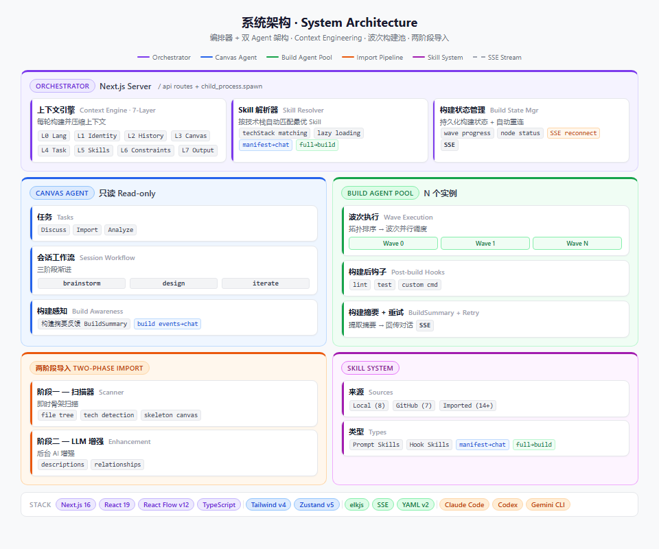
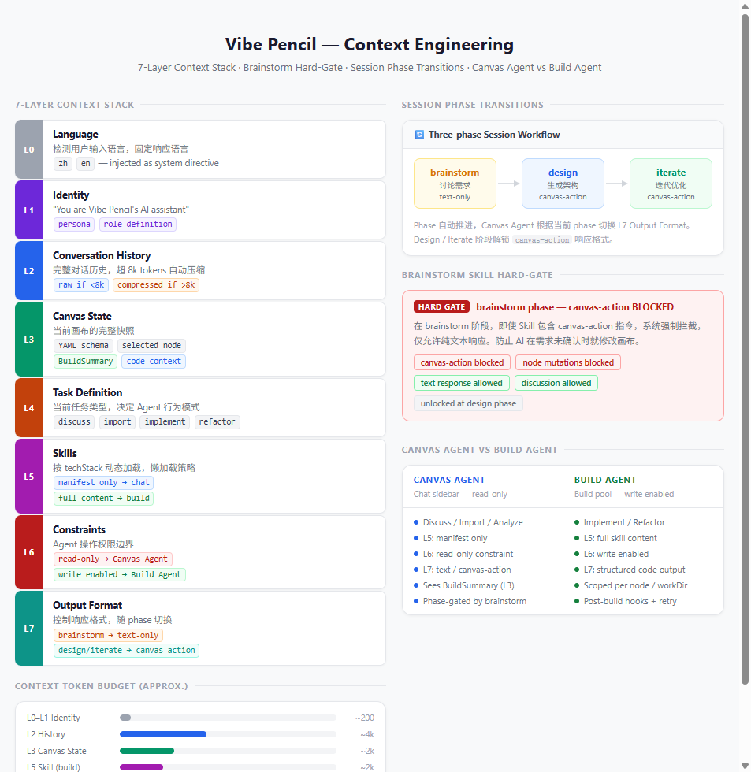
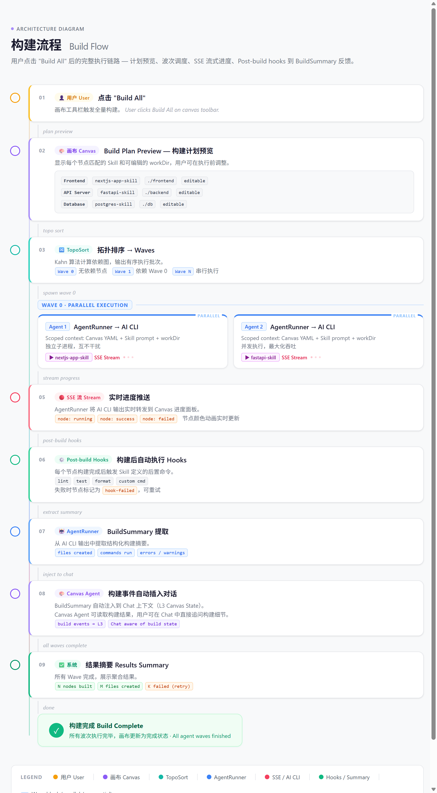
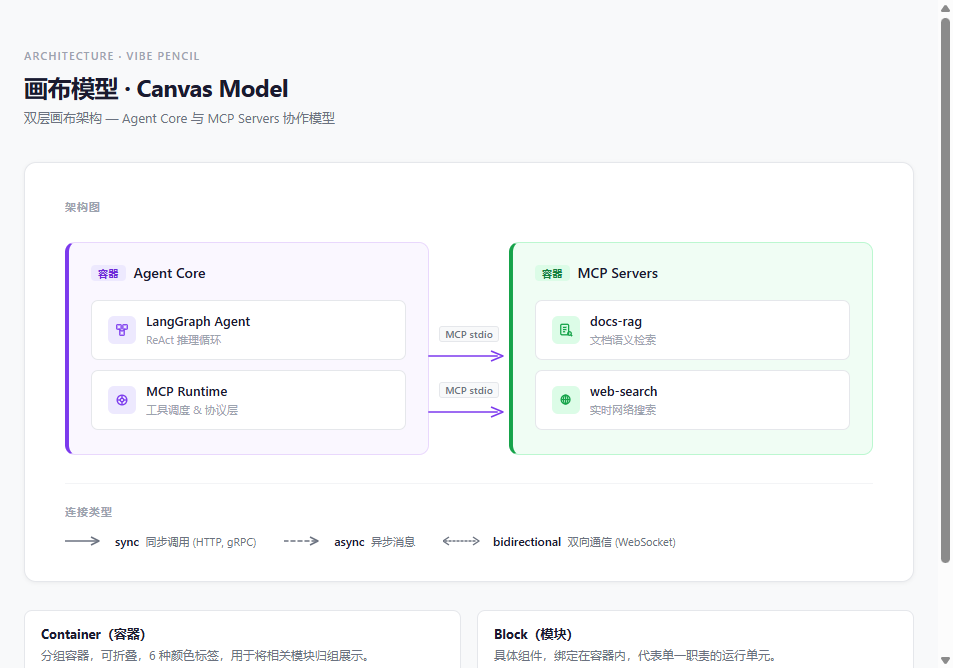

# ArchViber

**中文** | [English](README.en.md)

**一句话描述你的想法，AI 帮你设计架构、画出来、写代码。**

告诉 AI "帮我做一个跨境电商系统，要有选品、投流、风控和智能客服"。它会像资深架构师一样追问你：选品是爬虫抓取还是 API 对接？投流要对接哪些广告平台？风控规则走规则引擎还是 AI 模型？讨论完毕，架构图自动出现在画布上——选品引擎、广告投放、风控中心、AI 客服，容器、模块、连线全部就位。然后一键构建，AI 按依赖顺序并行生成每个模块的代码。

**这不是画图工具。** 这是一个 AI 架构搭档：从模糊想法到可运行代码，全程对话驱动。

> **Demo 截图即将上线** — 下方架构图展示系统内部设计。

---

## 谁需要这个？

- **"我有个 App 想法但不会写代码"** — PM、创始人、独立创作者。用对话把想法变成真实项目。
- **"我想快速验证一个架构方案"** — 架构师。30 秒看到完整架构图，比白板快 10 倍。
- **"我想让 AI 帮我搭项目骨架"** — 开发者。跳过重复的脚手架工作，专注核心逻辑。

---

## 核心流程

1. 💬 **"帮我做一个跨境电商系统，要有选品、投流、风控和智能客服"** — 一句话开始。AI 像资深架构师一样追问：选品数据从哪来？需要对接哪些广告平台？客服要多语言吗？
2. 🧠 **AI 头脑风暴** — 讨论技术选型、数据库设计、API 结构。AI 主动提出你没想到的问题，直到方案确认。
3. 🎨 **架构图自动生成** — 容器、模块、连线瞬间出现在画布上。不需要手动拖拽，不需要学任何画图工具。
4. 🔄 **对话迭代** — "加上支付功能"、"把数据库拆成读写分离" → 架构图实时更新。每一步都能撤销。
5. 🚀 **一键构建** — 按依赖拓扑排序，波次并行调度 AI 生成代码。实时看到每个模块的构建进度。

```
"做一个跨境电商系统" ──→ AI 头脑风暴 ──→ 架构图自动生成 ──→ 对话迭代 ──→ 一键构建
一句话开始              追问·选型·确认    画布自动排列       实时更新      波次并行生成代码
```

---

## 架构设计

系统采用 **2-Agent 架构**：Canvas Agent（只读，负责对话和设计）和 Build Agent（可写，负责代码生成）。每个 Agent 接收一个由 7 层 context stack 精确构建的上下文窗口，确保 AI 在每个阶段只看到它需要的信息。

### 系统架构



### Context Engineering



### 构建流程



### 画布模型



---

## 亮点功能

| 能力 | 为什么值得关注 |
|---|---|
| **AI 头脑风暴工作流** | 三阶段渐进推进（brainstorm → design → iterate），AI 主动追问直到方案确认，而不是一次性生成 |
| **2-Agent 架构** | 设计和构建分离——AI 在讨论阶段不会乱改你的画布，构建阶段才获得写权限。7 层 context stack 确保 AI 永远不丢失上下文 |
| **构建进度实时可见** | 构建状态自动出现在对话中，你可以直接追问"为什么这个模块构建失败了？"，AI 知道答案 |
| **15+ 内置技能 + GitHub 一键导入** | 告诉 AI 你用 Next.js，它自动匹配最优构建技能。还能从 GitHub 一键导入社区技能 |
| **导入代码库秒速反向生成架构** | 把现有项目拖进来，秒速生成架构图，后台 AI 自动补充描述和关系 |
| **9 种导出选项** | YAML / JSON / PNG / Mermaid / Markdown / 会话备份 / 项目存档 / 剪贴板 |

---

## 功能列表

### 画布与设计

| 功能 | 描述 |
|---|---|
| Container + Block 两层架构 | 容器分组 + 内部模块，elkjs 复合布局自动排列 |
| 容器可缩放 | 选中容器出现 resize handle，自由调整尺寸 |
| 8 方向智能连接点 | 位置感知边路由，自动选取最优连接点对 |
| 连线类型 | `sync`（同步调用）/ `async`（异步消息）/ `bidirectional`（双向通信） |
| Undo / Redo | 50 步快照，`Ctrl+Z` / `Ctrl+Shift+Z` |
| 会话-画布联动 | 切换聊天会话自动保存/恢复对应画布状态 |

### AI 对话与工作流

| 功能 | 描述 |
|---|---|
| AI 对话 | 与 AI 讨论架构方案，AI 可直接修改画布（canvas-action） |
| 三阶段会话工作流 | brainstorm → design → iterate 渐进式推进 |
| Context Engineering | 7 层 context stack，2-agent 架构（Canvas Agent + Build Agent） |
| Chat-Build 联动 | Chat agent 实时感知 build 状态，构建事件自动插入对话 |
| Markdown 渲染 | 代码高亮、GFM 表格、代码块语法着色 |
| 会话标题 AI 生成 | 对话后自动总结会话标题 |
| 项目名自动生成 | 从架构内容智能命名项目 |

### 构建系统

| 功能 | 描述 |
|---|---|
| 一键构建 Build All | 拓扑排序波次并行生成代码，最大化并发 |
| 三种 AI 后端 | Claude Code / Codex / Gemini CLI，按需切换 |
| Skill 系统 | 15+ 内置技能 + GitHub 导入 + 本地导入，techStack 自动匹配 |
| Post-build hooks | Skill 可定义构建后自动执行的命令（如 lint、测试） |
| Build 进度面板 | 实时波次进度、节点动画、趣味加载文字 |
| Build 断线重连 | 刷新页面后自动恢复 build 状态 |
| SSE 实时流 | Server-Sent Events 推送构建输出和状态变更 |

### 导入 / 导出

| 功能 | 描述 |
|---|---|
| 两阶段导入 | 秒速骨架扫描 + 后台 AI 增强，反向工程现有代码库 |
| 9 项导出 | YAML / JSON / PNG / Mermaid / Markdown / 会话备份 / 项目存档 / 剪贴板 |

### 其他

- **多语言** — 中英双语 i18n
- **进度组件** — StatusBar 内嵌自动进度计算
- **自动保存** — 本地工作区自动持久化

---

## 技术栈

| 层级 | 技术 |
|---|---|
| 框架 | Next.js 16 (App Router) |
| 画布 | React Flow (`@xyflow/react` v12) |
| 布局引擎 | elkjs（复合布局） |
| 样式 | Tailwind CSS v4 |
| 状态管理 | Zustand v5 |
| 流式传输 | Server-Sent Events (SSE) |
| Agent 执行 | Node.js `child_process.spawn` |
| Markdown | react-markdown + rehype-highlight + remark-gfm |
| YAML 序列化 | `yaml` v2 |
| 测试 | Vitest v4 + Testing Library |
| 语言 | TypeScript |

---

## 快速开始

**前置条件**：Node.js 20+

```bash
git clone https://github.com/URaux/arch-viber.git
cd arch-viber
npm install
npm run dev        # http://localhost:3000
```

> 画布和 AI 对话功能无需额外配置即可使用。要使用 **Build All** 构建功能，请安装下方至少一种 AI CLI 工具。AI CLI 工具使用各自的认证方式（如 `claude login`），无需在本项目中配置 API Key。

**测试**：
```bash
npm test           # 运行全部测试
npx vitest         # 监听模式
```

**安装 AI CLI 工具**（按需选择一种或多种）：
```bash
npm install -g @anthropic-ai/claude-code   # Claude Code
npm install -g @openai/codex               # Codex
npm install -g @google/gemini-cli          # Gemini CLI
```

---

## API 接口

| 方法 | 路由 | 描述 |
|---|---|---|
| `POST` | `/api/agent/spawn` | 启动单个 Agent 或完整 BuildAll 波次计划 |
| `GET` | `/api/agent/status` | 查询 Agent 状态 |
| `GET` | `/api/agent/stream` | SSE 事件流（状态变更、输出、波次） |
| `POST` | `/api/agent/stop` | 终止运行中的 Agent |
| `GET` | `/api/agent/build-state` | 获取持久化的构建状态（断线重连） |
| `POST` | `/api/chat` | SSE 流式 AI 对话 |
| `GET` | `/api/models` | 获取指定后端的模型列表 |
| `POST` | `/api/project/save` | 保存项目 |
| `POST` | `/api/project/load` | 加载项目 |
| `POST` | `/api/project/scan` | 两阶段导入：骨架扫描 |
| `POST` | `/api/project/import` | 两阶段导入：AI 增强 |
| `GET` | `/api/skills/list` | 列出所有可用 Skill |
| `POST` | `/api/skills/add` | 从 GitHub / 本地路径导入 Skill |
| `POST` | `/api/skills/resolve` | 根据 techStack 匹配最优 Skill |
| `POST` | `/api/build/read-files` | 读取构建产物文件（post-build hooks） |

---

## License

MIT
