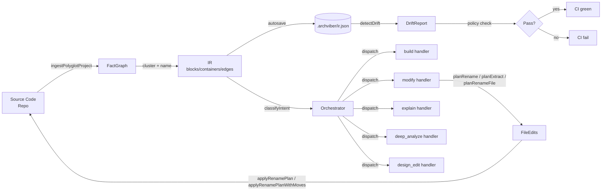

# ArchViber Architecture

> Version 0.4 — updated phase3/docs-architecture

## Overview

ArchViber is a diagram-as-code tool that keeps architecture diagrams in sync with source code. The core loop is: **ingest code → build IR → detect drift → orchestrate AI actions → apply edits**.



---

## (a) IR Data Model

**Key file:** `src/lib/ir/schema.ts`

The Intermediate Representation (IR) is a Zod-validated JSON document stored at `.archviber/ir.json`.

| Entity | Key fields |
|--------|-----------|
| `IrContainer` | `id`, `name`, `color` (blue/green/purple/amber/rose/slate) |
| `IrBlock` | `id`, `name`, `description`, `status`, `container_id`, `tech_stack`, `code_anchors[]`, `schema?` |
| `IrEdge` | `id`, `source`, `target`, `type` (sync/async/bidirectional), `label?` |
| `IrAuditEntry` | `timestamp`, `action`, `actor`, `details` |

`IrBlock.code_anchors` is a `CodeAnchor[]` — each anchor links a block to source files via `{ files: [{ path, symbols[], lines? }], primary_entry? }`. This is the field drift detection focuses on.

`IrBlock.schema` carries optional DB table/column/index metadata for data-store blocks.

Persistence layer: `src/lib/ir/persist.ts` (read/write), `src/lib/ir/autosave.ts` (debounced writes), `src/lib/ir/migrate.ts` (version upgrades).

---

## (b) Ingest Pipeline + LanguageAdapter Pattern

**Key files:** `src/lib/ingest/pipeline.ts`, `src/lib/ingest/languages/registry.ts`, `src/lib/ingest/facts.ts`

```
walkProject(root)
  → per-file: findAdapter(filePath) → LanguageAdapter
  → adapter.loadParser() → tree-sitter Parser (WASM, cached per adapter)
  → adapter.extractFacts(tree, relPath) → FactInputModule
  → buildFactGraph({ modules, pathAliases }) → FactGraph
  → cluster(graph) → community-detected clusters
  → name clusters via LLM → IrContainers + IrBlocks + IrEdges
```

**LanguageAdapter** (`src/lib/ingest/languages/types.ts`) is a three-field interface:
- `id` — language identifier string
- `loadParser()` — async, returns a cached tree-sitter parser
- `extractFacts(tree, file)` — pure AST→facts transform, no I/O

Built-in adapters: TypeScript (`typescript.ts`), Python (`python.ts`), Go (`go.ts`), Java (`java.ts`), Rust (`rust.ts`). All registered in `register-defaults.ts`.

> See [HOW-TO-ADD-A-LANGUAGE.md](HOW-TO-ADD-A-LANGUAGE.md) to add a new language — no core changes needed, ~1 day of AST-query work.

Clustering: `src/lib/ingest/cluster.ts` (Louvain community detection). Anchor coverage: `src/lib/ingest/anchor-coverage.ts`.

---

## (c) Orchestrator — 5 Intents

**Key files:** `src/lib/orchestrator/classify.ts`, `src/lib/orchestrator/dispatch.ts`, `src/lib/orchestrator/handlers/`

**Flow:** `classifyIntent(prompt, irSummary)` → `dispatch(intent, ctx)` → handler

### Classification

`classifyIntent` spawns a short-lived LLM agent (backend: `codex`, model: `gpt-5-codex-mini`) with a strict JSON-output system prompt. It polls for completion (25 ms interval, 10 s timeout) then validates the response. If confidence < 0.6 or parse fails, falls back to `explain`.

### 5 Intents

| Intent | Handler file | Description |
|--------|-------------|-------------|
| `design_edit` | `handlers/design_edit.ts` | Edit diagram layout/labels |
| `build` | `handlers/build.ts` | Scaffold new blocks/services |
| `modify` | `handlers/modify.ts` | Refactor source code via Modify verbs |
| `deep_analyze` | `handlers/deep_analyze.ts` | Deep code analysis + summaries |
| `explain` | `handlers/explain.ts` | Explain the current IR/diagram |

`HandlerContext` carries `{ userPrompt, irSummary, ir?, classifyResult, runner?, workDir? }`.
`HandlerResult` is `{ intent, status: 'ok'|'not_implemented'|'error', payload?, error? }`.

Orchestrator telemetry is appended to `.archviber/cache/orchestrator-log.jsonl` for history and eval use (`src/lib/orchestrator/log.ts`).

---

## (d) Modify Verbs (v0.3 + v0.4)

**Key files:** `src/lib/modify/rename.ts`, `src/lib/modify/extract.ts`, `src/lib/modify/rename-file.ts`, `src/lib/modify/apply.ts`, `src/lib/modify/sandbox.ts`, `src/lib/modify/pr.ts`

All verbs follow the **plan → apply** pattern: the plan function is pure (no disk writes), returns a typed plan object; the apply function mutates files.

| Verb | Plan fn | Apply fn | What it does |
|------|---------|---------|-------------|
| `rename` | `planRename` | `applyRenamePlan` | Rename a symbol across all TS files |
| `extract` | `planExtractMethod` | `applyRenamePlan` | Extract a block of code into a new function |
| `rename-file` | `planRenameFile` | `applyRenamePlanWithMoves` | Move a TS file + rewrite all import specifiers |
| `inline-variable` | `planInlineVariable` | `applyRenamePlan` | Inline a variable at all use sites |

`applyRenamePlanWithMoves` (`rename-file.ts`) handles `fileMove` edits (fs.rename) in addition to in-file specifier rewrites.

`RenamePlan.conflicts` surfaces errors (kind: `'not-found'` | `'collision'` | `'ambiguous'`) without throwing.

`sandbox.ts` provides a temporary project fixture helper for tests. `pr.ts` generates PR descriptions from plans.

---

## (e) Drift Detection + Policy Enforcement

**Key files:** `src/lib/drift/detect.ts`, `src/lib/policy/schema.ts`, `src/lib/policy/check.ts`, `src/lib/policy/filter.ts`, `src/lib/policy/load.ts`

### Detection

`detectDrift(baseIr, headIr) → DriftReport` diffs blocks, containers, and edges by `id`. Block "changed" means any of: name, `container_id`, `tech_stack`, or `code_anchors` differ.

```ts
DriftReport {
  addedBlocks, removedBlocks, changedBlocks  // BlockChange has before/after/changes[]
  addedContainers, removedContainers
  addedEdges, removedEdges
  clean: boolean
}
```

### Policy Enforcement

`.archviber/policy.yaml` configures drift gating:

```yaml
drift:
  failOnRemoved: true
  maxChangedBlocks: 5
  ignoreBlockIds: [legacy-worker]   # tag/glob filters also supported
  ignoreContainerIds: []
  ignoreEdgeIds: []
```

`policy/filter.ts` strips ignored IDs from the report before `policy/check.ts` evaluates pass/fail thresholds (`failOnRemoved`, `failOnAdded`, `failOnChanged`, `maxAddedBlocks`, `maxRemovedBlocks`, `maxChangedBlocks`, `failOnRemovedContainers`, `failOnRemovedEdges`).

All fields default to permissive (no blocking). Policy loaded via `policy/load.ts` from `<projectRoot>/.archviber/policy.yaml`.

---

## (f) Eval Harness

**Key files:** `.github/workflows/eval.yml`, `src/lib/orchestrator/log.ts`

The eval harness validates orchestrator quality in CI:

- **Mock CI gate** — `eval.yml` workflow runs a fixed prompt suite against the orchestrator and asserts expected intents/outputs.
- **Live cron** — scheduled eval runs on `main` to catch regressions over time.
- **History viewer** — reads `.archviber/cache/orchestrator-log.jsonl`; each entry carries `{ intent, status, userPrompt, timestamp, durationMs }`.
- **Alerts** — eval failures post to PR checks; threshold breaches (e.g., <80% classify accuracy) fail the workflow.

---

## (g) PR Review Bot

**Key files:** `.github/workflows/drift.yml`

The `drift.yml` workflow runs on every PR:

1. Checks out base and head IR snapshots.
2. Calls `detectDrift(baseIr, headIr)` and applies policy filters.
3. Posts a drift summary as a PR comment.
4. If policy thresholds are exceeded, sets a failing check status.
5. Separately, spawns an LLM architectural review call on the changed blocks to surface non-obvious coupling or contract violations as review suggestions.

---

## Key File Index

| Area | Files |
|------|-------|
| IR schema & persist | `src/lib/ir/schema.ts`, `persist.ts`, `autosave.ts`, `migrate.ts` |
| Ingest pipeline | `src/lib/ingest/pipeline.ts`, `facts.ts`, `cluster.ts`, `code-anchors.ts` |
| Language adapters | `src/lib/ingest/languages/{typescript,python,go,java,rust}.ts` |
| Orchestrator core | `src/lib/orchestrator/{classify,dispatch,types,log}.ts` |
| Handlers | `src/lib/orchestrator/handlers/{build,modify,explain,deep_analyze,design_edit}.ts` |
| Modify verbs | `src/lib/modify/{rename,extract,rename-file,apply}.ts` |
| Drift & policy | `src/lib/drift/detect.ts`, `src/lib/policy/{schema,check,filter,load}.ts` |
| CI workflows | `.github/workflows/{drift,eval,ci}.yml` |
